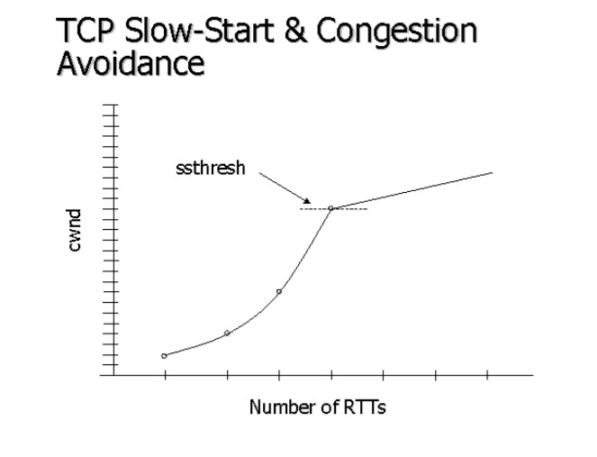
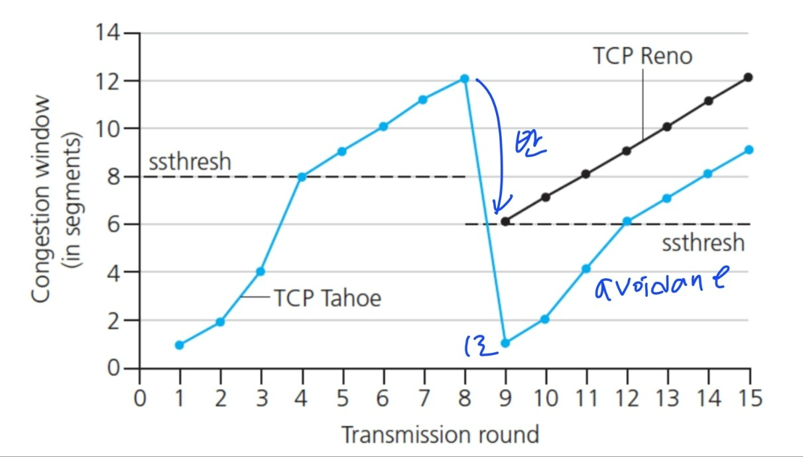

# TCP/IP 흐름제어와 혼잡제어
> TCP는 신뢰성 보장을 위한, `제어기능`이 있다!!
> 이때 제어기능이란?
> - 흐름 제어 `flow control` : 전송되는 데이터의 양 조절
> - 오류 제어 : 데이터 유실 등 데이터 수신 오류에 대처
> - 혼잡 제어 `congestion ctrl` : '전송률'을 조절해 네트워크 혼잡 상황에 대처
 

## 흐름제어
> 수신자는 송신자를 조절하여, 수신측 **버퍼에  오버플로우**가 일어나지 않도록 함.
> 즉, 송신자가 수신 버퍼 대비 **너무 많은 양의 데이터를 보내지 않도록** 조절함.

- 흐름 제어 방법
	- Stop and Wait
	- Sliding window

### stop-and-wait
##### 과정
-   sender: 한개의 패킷만 보내고, 그에 대한 ACK 올때까지 기다림
-   receiver가 ACK 보내오면, sender는 보내기 재개함
-   ACK 오지 않은채 timer 끝나면, sender는 이전에 보낸 패킷 재전송 (패킷손실상황)
    -   sender는 packet loss와 ACK loss를 구별하지 못함
    -   receiver은 구분함. ACK loss에 따라 sender가 재전송한 패킷은 receiver가 알아서 버리고 ACK만 리턴해줌 (패킷 중복저장할필요 없으니까)

 ### sliding window
 > 송신측이 수신측에서 받은 window size를 참고하여, 데이터 흐름을 제어함
 
 ##### 과정
 - 3-way handshaking 과정에서, window size를 송신측에 전달
	 - window size == receiver가 한번에 처리할 수 있는 데이터 양
 - 데이터 전송시, window에 포함되는(= window size에 맞는) 모든 패킷을 전송함
 - 그 패킷들 전달 성공이 확인된다면,  window을 옆으로 밀어 다음 패킷들 전송
 
 ##### 특징
 - window size는 유동적으로 조절됨
	 - congestion ctrl과도 관련
 - 상대방의 응답 없이도, window size 내에서 데이터 전송 가능
 

## 혼잡제어
> 혼잡: 너무 많은 소스들이, 네트워크가 처리하기에는 너무 빠르게, 너무 많은 데이터를 보내는 상황 
> - flow ctrl과는 다르다!
>   - 혼잡 제어는 global issue임! (= 네트워크를 공유중인 노드들 간의 이슈)
> 	- 흐름 제어는 point to point 이슈 (=sender와 receiver 간의 이슈)
	
- 혼잡 제어 방법
	- AIMD 
	- Slow Start
	- Fast Retransmit
	- Fast Recovery

### AIMD
-  손실 발생전까지 transmission rate(윈도우크기)를 증가시키며 패킷 송신
    -   Additive Increase : 손실발생전까지, 각 RTT마다 cwnd를 1MSS만큼 증가
    -   Multiplicative Decrease : 손실 발생시, cwnd를 절반으로 감소시킴

### Slow Start
- 손실 발생전까지 transmission rate를 지수함수꼴로 증가시키며 패킷 송신
- 손실이 발생한다면, 그 때의 window size의 절반값으로 설정.
- 그 이후부터는 1씩 증가

### Fast Retransmit
- sender가 3개의 중복된 ACK를 받는다면, 손실된 패킷 재전송
- 혼잡 감지. window size 줄임
- TCP Tahoe

### Fast Recovery
- 혼잡 감지시, window size를 줄이되, 1로 줄이지 않고 절반값으로 줄임
- 그 후 선형 증가시킴 
- TCP Reno 

