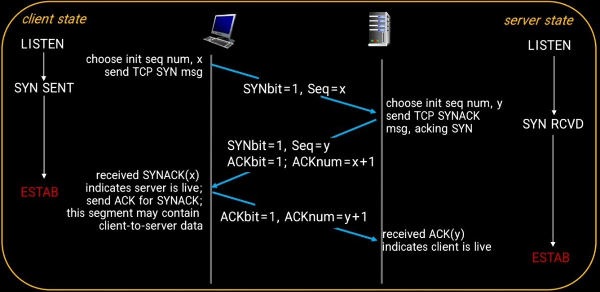

### review
##### OSI 7계층
	- Application
	- Presentation
	- Session
	- Transport => 인터넷 transport 프로토콜: TCP, UDP
	- Network
	- Link
	- Physical

##### TCP ?
	- Transmission Control Protocol
	- UDP와 비교했을때,
		- 신뢰성 높음
		- 속도 느림
		- ex) 메일, 웹 브라우징

***
# TCP 3-way handshake와 4-way handshake

> TCP는 `정확성/신뢰성` 있는 전송을 보장해줘야함
	>  -> 그를 위한 과정: handshaking
		> 1. Establishing Connection (접속 성립) : 3-way
		> 2. Closing Connection (접속 종료) : 4-way

## 3-way handshake
> 접속 성립을 위한 과정

#### 과정
- Step 1.
	- A: SYN 패킷 전송 후, 응답(=SYN/ACK)을 기다리는 상태(=SYN_SENT)
- Step 2.
	- B: SYN요청을 받은 후, A의 요청을 수락한다는 ACK를 A에게 보내줌. 
	- 이때 SYN flag = 1
	- B는 A의 응답을 기다리는 SYN_RECEVIED 상태
- Step 3.
	- A는 B의 ACK를 잘 받았다는 의미로 B에게 ACK를 보내줌
	- 그 ACK를 B가 잘 받았을 때부터 `ESTABLISHED` 상태!

>
	이러한 과정이 3-way handshake

>용어 참고)
>- ACK:
>- SYN:
>- flag

## 4-way handshake
 > 세션을 종료하기 위한 과정
 
 
 ### 과정
 - Step 1.
	 - A: 연결을 종료하겠다는 의미로, B에게 FIN 패킷 전송
	 - 이때 A의 상태 : FIN_WAIT
 - Step 2.
	 - B: FIN 패킷 수신. 알겠다는 의미로 A에게 ACK 패킷 전송 
	 - 이때 B의 상태: CLOSE_WAIT
		 - B가 하던중인 통신 이어서 마저함. 그 통신이 끝날때까지 기다림.
 - Step 3.
	 - B가 하던일 다 끝나서 연결을 종료할 준비가 되었다면, A에게 FIN 패킷 전송.
	 - 이때 B의 상태: LAST_ACK
 - Step 4.
	 - A는 B가 보낸 FIN 수신. 알겠다는 의미로 B에게 ACK 전송.
	 - 이때 A의 상태: TIMED_WAIT
>
	이러한 과정이 4-way handshake
>용어 참고)
>- FIN: Finish 