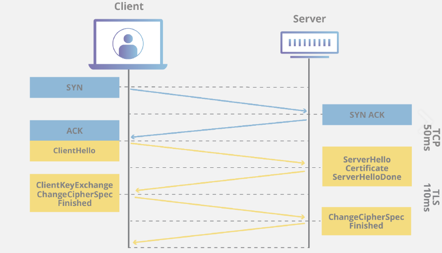

# TLS/SSL 프로토콜의 역할과 handshake

## SSL 프로토콜이란 무엇일까?

#### SSL 프로토콜 (Secure Sockets Layer)
- 브라우저와 서버 사이 등 전송하는 데이터를 암호화하여, 인터넷 연결을 보호하기 위한 표준 보안 프로토콜이다.
- 앞서 말한 HTTPS는, HTTP에 `SSL`을 추가한 것이다. 
> 정확히는, HTTPS란 SSL 프로토콜 위에서 돌아가는 프로토콜이다.
>
>HTTPS의 'S'는 Over Secure Socket Layer의 약자이다.

-  1996년 이후 업데이트 되지 않았으며, 알려진 여러 취약성이 있기에, SSL 사용은 지양하고 TLS 사용을 권장한다.

## TLS 프로토콜이란 무엇일까?

#### TLS 프로토콜 (Transport Layer Security)
- SSL의 업데이트 버전
- 더욱 향상된, 안전한 버전의 SSL

## TLS/SSL handShake 란 무엇일까?
#### TLS/SSL 작동 방식
- handshake을 통해 인증이 이루어진다. 
- 개인정보 보호를 위해, 웹에서 전송되는 데이터를 암호화한다.
	- 공개키와 대칭키를 혼합해서 사용한다.
>  클라이언트와 서버가 주고받는 실제 정보 -> 대칭키 암호화 방식 用 
> 실제 정보를 복호화할 때 사용할 대칭키를 암호화 -> 공개키 암호화 방식 用

 

#### TLS/SSL handshake
> HTTPS 통신 과정에서, 데이터를 암호화할 '키'를 타인에게 노출시키지 않고 전송하기 위한 협상과정.
>
>포함되는 요소
>: SSL 인증서 전달, 키 전달, 암호화 알고리즘 결정, SSL/TLS 프로토콜 결정 등  

##### handshake 상세 과정
1. Client Hello: 클라이언트가 서버에 연결 시도하며 전송하는 패킷
	> <이때 전달하는 정보>
	>
	> - 사용 가능한 Cipher Suite 목록
			> -> Cipher Suite의 알고리즘에 따라 데이터 암호화함
	> - 세션 아이디
	> - SSL 버전 등
2. Server Hello: Client Hello에 대한 서버의 응답 패킷
	> <이때 전달하는 정보>
	>
	> - 클라이언트에서 보낸 Cipher Suite 목록 중 서버가 선택한 Cipher Suite
	> - SSL 버전 등
3. Certificate: 서버가 자신의 SSL 인증서를 Client에게 전달함 with 공개키 (개인키는 서버가 소유)
 	> - 이때 클라이언트는 서버가 보낸 인증서가 CA에 의해 발급된 것인지 확인함.
	> - CA의 공개키를 사용해서 SSL 인증서를 복호화 하는 과정이 성공한다면! CA가 해당 인증서를 발급한게 맞다는것.
4. Server Key Exchange / ServerHello Done 
	> - 서버의 공개키가 SSL 인증서 내부에 없다면
	> 	- 서버가 직접 전달한다는 의미
	>  - 서버의 공개키가 SSL 인증서 내부에 있다면
	> 		- Server Key Exchange 생략. 
	> 		- 대신, 클라이언트가 CA의 공개키를 통해 인증서 복호화 후, 서버의 공개키를 확보함.
5. Client Key Exchange 
	> 대칭키를 Client가 생성하여, SSL 인증서 내부에서 추출한 Server의 공개키를 이용해 암호화한 후 서버에게 전달
6. ChangeCipherSpec / Finished : 교환할 정보 모두 교환뒤 통신할 준비가 다되었음을 알리는 패킷. SSL Handshake 종료  
